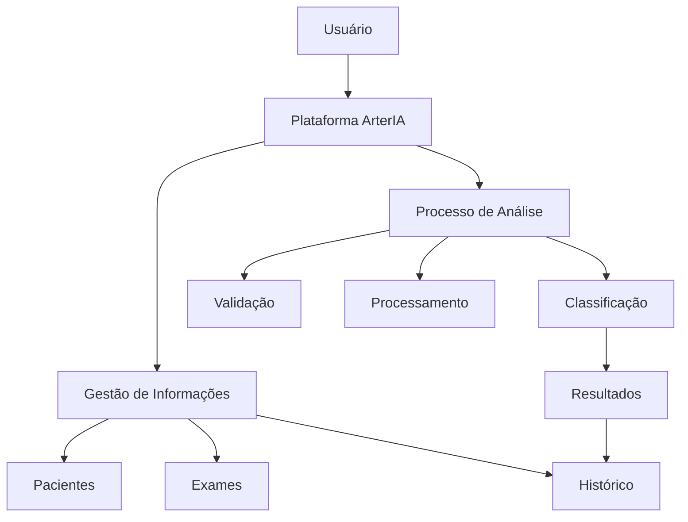

# 🫀 ArterIA

**Plataforma de apoio à análise de mamografias e à classificação da calcificação arterial mamária.**

Radiologia • Análise de Imagens • Apoio à Análise Clínica

---

# 📑 Índice

- [📖 Sobre o Projeto](#-sobre-o-projeto)
- [🩺 Contexto](#-contexto)
- [❗ O Problema](#-o-problema)
- [💡 A Solução Proposta](#-a-solução-proposta)
- [🎯 Objetivo do Projeto](#-objetivo-do-projeto)
  * [Objetivo Geral](#objetivo-geral)
  * [Objetivos Específicos](#objetivos-específicos)
- [📌 Justificativa](#-justificativa)
- [👥 Público de Interesse](#-público-de-interesse)
- [🎯 Escopo do Projeto](#-escopo-do-projeto)
- [🔄 Como o Sistema Funcionará](#-como-o-sistema-funcionará)
- [🔬 Fluxo de Análise](#-fluxo-de-análise)
- [👤 Gestão de Pacientes e Exames](#-gestão-de-pacientes-e-exames)
- [📊 Classificação da Calcificação](#-classificação-da-calcificação)
- [📈 Apresentação dos Resultados](#-apresentação-dos-resultados)
- [✨ Principais Funcionalidades](#-principais-funcionalidades)
- [🏗️ Arquitetura Conceitual](#️-arquitetura-conceitual)
- [📋 Regras de Negócio](#-regras-de-negócio)
- [🚫 Fora do Escopo](#-fora-do-escopo)
- [⚠️ Limitações e Responsabilidade Clínica](#️-limitações-e-responsabilidade-clínica)
- [🔮 Visão de Evolução](#-visão-de-evolução)
- [Instalação e Execução (Front-end)](#instalação-e-execução-front-end)
- [🫀 Visão do ArterIA](#-visão-do-arteria)

---

# 📖 Sobre o Projeto

O **ArterIA** é uma plataforma voltada ao apoio à análise de exames de mamografia, com foco na identificação, avaliação e classificação da **calcificação arterial mamária**.

O projeto propõe a utilização de recursos computacionais para estruturar o fluxo de análise de imagens mamográficas, permitindo o recebimento dos exames, o processamento das imagens, a identificação de características relacionadas ao objetivo do sistema e a apresentação de resultados de maneira organizada e rastreável.

Além da análise individual dos exames, a plataforma deverá permitir a organização das informações por paciente, mantendo a relação entre os exames realizados, as imagens associadas, as análises executadas e os resultados obtidos.

A classificação inicial prevista pelo projeto será organizada em três níveis:

| Classificação | Nível         |
| ------------- | ------------- |
| 🟢             | **Leve**      |
| 🟡             | **Moderada**  |
| 🔴             | **Acentuada** |

> **Importante:** O ArterIA é concebido como uma ferramenta de **apoio à análise clínica**. O sistema não tem como objetivo substituir a avaliação, interpretação ou responsabilidade de profissionais habilitados.

---

# 🩺 Contexto

A mamografia é um exame de imagem utilizado na avaliação das mamas. Durante a interpretação dessas imagens, diferentes estruturas e achados podem ser observados pelo profissional responsável pela análise.

Entre os achados que podem estar presentes está a **calcificação arterial mamária**, relacionada à presença de calcificações associadas às estruturas vasculares observáveis no exame.

A identificação e avaliação desses achados dependem de análise adequada das imagens e da interpretação dentro do contexto clínico da paciente.

Entretanto, processos baseados exclusivamente na avaliação visual podem apresentar desafios relacionados à padronização, organização das informações e acompanhamento dos exames ao longo do tempo.

Nesse contexto, o ArterIA propõe uma abordagem voltada à utilização de recursos computacionais para apoiar a estruturação desse processo.

---

# ❗ O Problema

A análise de imagens médicas é um processo que exige conhecimento técnico, experiência profissional e avaliação cuidadosa das informações presentes no exame.

Quando um determinado achado precisa ser identificado, classificado e acompanhado ao longo do tempo, podem surgir desafios relacionados à organização, padronização e rastreabilidade dessas informações.

Entre os principais desafios estão:

## 🔹 Variabilidade na interpretação

A análise visual pode apresentar diferenças entre profissionais ou entre avaliações realizadas em momentos distintos.

## 🔹 Dificuldade de padronização

Sem uma estrutura definida para registro e classificação, os achados podem ser documentados de diferentes maneiras.

## 🔹 Grande volume de informações

Ambientes clínicos podem lidar com uma quantidade significativa de pacientes, exames e imagens, tornando a organização e recuperação dessas informações mais complexa.

## 🔹 Histórico pouco estruturado

A consulta a exames anteriores e o acompanhamento das informações ao longo do tempo podem exigir a navegação por diferentes registros.

## 🔹 Necessidade de rastreabilidade

É importante estabelecer uma relação clara entre o paciente, o exame realizado, as imagens utilizadas, o processo de análise e o resultado obtido.

Diante desse cenário, o problema central abordado pelo ArterIA é a necessidade de estruturar um fluxo capaz de:

> **Receber, organizar, analisar e apresentar informações relacionadas à calcificação arterial mamária de forma padronizada, rastreável e integrada ao histórico do paciente.**

---

# 💡 A Solução Proposta

O ArterIA propõe uma plataforma centralizada para gerenciamento e análise de exames mamográficos.

A solução será estruturada para acompanhar o ciclo completo de uma análise, desde a identificação do paciente até o armazenamento do resultado.

## Visão geral do fluxo


A relação entre essas etapas permitirá manter a rastreabilidade das informações dentro do sistema.

| Etapa             | Função                                                                  |
| ----------------- | ----------------------------------------------------------------------- |
| 👤 **Paciente**    | Identificação da pessoa vinculada aos registros.                        |
| 🩻 **Exame**       | Registro correspondente à realização da mamografia.                     |
| 🖼️ **Mamografia** | Imagem ou conjunto de imagens associado ao exame.                       |
| 🔍 **Análise**     | Processo responsável pela avaliação das características de interesse.   |
| 📊 **Resultado**   | Registro da classificação obtida após a análise.                        |
| 📚 **Histórico**   | Organização cronológica dos exames e resultados associados ao paciente. |

---

# 🎯 Objetivo do Projeto

## Objetivo Geral

Desenvolver uma plataforma de apoio à análise de imagens de mamografia capaz de identificar características relacionadas à calcificação arterial mamária e apresentar uma classificação estruturada do grau identificado, contribuindo para a padronização do processo de análise e para a organização do histórico de exames.

---

## Objetivos Específicos

O ArterIA busca:

- Permitir o cadastro e gerenciamento de pacientes;
- Permitir a criação e organização de exames;
- Receber imagens de mamografia para análise;
- Validar os arquivos enviados ao sistema;
- Processar as imagens conforme o fluxo definido para o projeto;
- Identificar características relacionadas à calcificação arterial mamária;
- Aplicar os critérios de classificação definidos;
- Apresentar os resultados de maneira clara e organizada;
- Associar cada resultado ao respectivo exame;
- Manter um histórico de exames e análises por paciente;
- Criar uma base estruturada para futuras análises comparativas e acompanhamento temporal.

---

# 📌 Justificativa

O avanço da computação aplicada à saúde tem ampliado as possibilidades de utilização de sistemas digitais como ferramentas de apoio à organização, processamento e análise de informações clínicas.

No contexto da radiologia, os exames de imagem representam uma importante fonte de informações visuais. A utilização de sistemas especializados pode contribuir para estruturar processos, organizar informações e criar mecanismos de apoio voltados à identificação de características específicas presentes nas imagens.

O ArterIA é proposto como uma solução voltada especificamente para a análise da **calcificação arterial mamária**, estabelecendo uma estrutura que permita organizar o ciclo completo entre paciente, exame, imagem, análise e resultado.

A relevância do projeto pode ser observada em diferentes dimensões.

## 🩺 Relevância clínica

A plataforma busca oferecer uma estrutura de apoio para identificação e classificação de características relacionadas à calcificação arterial mamária.

## 📊 Padronização

A utilização de critérios definidos para classificação permite estabelecer uma estrutura mais consistente para apresentação dos resultados.

## 🗂️ Organização da informação

A associação entre paciente, exame, imagem, análise e resultado permite a construção de um histórico estruturado.

## ⏱️ Organização do fluxo

A centralização das etapas do processo permite estabelecer um fluxo mais organizado para o gerenciamento das análises.

## 🔬 Relevância científica e acadêmica

O projeto cria uma base para estudos relacionados à análise de imagens médicas, processamento de imagens e aplicação de sistemas inteligentes no contexto da saúde.

## 🚀 Potencial de evolução

A estrutura do ArterIA permite futuras evoluções, incluindo análises comparativas, métricas quantitativas e acompanhamento histórico.

---

# 👥 Público de Interesse

O ArterIA é direcionado principalmente a contextos relacionados a:

- 🩻 Radiologistas;
- 🩺 Profissionais habilitados envolvidos na análise de exames;
- 🏥 Clínicas de diagnóstico por imagem;
- 🏨 Instituições hospitalares;
- 🔬 Pesquisadores;
- 🎓 Instituições acadêmicas;
- 📚 Projetos relacionados à radiologia e análise de imagens médicas.

Os fluxos definitivos de utilização deverão ser refinados conforme o levantamento e validação dos requisitos com os profissionais envolvidos no domínio.

---

# 🎯 Escopo do Projeto

O escopo inicial do ArterIA está concentrado na construção de uma plataforma capaz de organizar e apoiar o processo de análise de mamografias relacionadas ao objetivo do projeto.

## 👤 Gestão de Pacientes

O sistema deverá permitir:

- Cadastro de pacientes;
- Consulta de pacientes;
- Localização de registros;
- Visualização das informações associadas;
- Consulta ao histórico de exames.

---

## 🩻 Gestão de Exames

Cada exame deverá possuir um registro próprio e estar associado a um paciente.

O sistema deverá permitir:

- Criação de exames;
- Organização dos exames realizados;
- Associação de imagens;
- Acompanhamento do status da análise;
- Consulta aos resultados.

---

## 🖼️ Gestão de Mamografias

O sistema deverá permitir:

- Envio de imagens;
- Validação dos arquivos;
- Associação das imagens ao exame correspondente;
- Organização das imagens vinculadas ao paciente;
- Recuperação das informações necessárias para visualização e análise.

---

## 🔍 Análise

Após o envio e validação da imagem, o exame deverá ser encaminhado para o fluxo de análise definido pelo projeto.

A análise deverá produzir informações que permitam a classificação do exame de acordo com os critérios estabelecidos.

---

## 📊 Resultado

Ao final do processo, o sistema deverá apresentar informações como:

- Status da análise;
- Classificação obtida;
- Informações relacionadas ao exame;
- Informações relacionadas ao paciente;
- Data da análise;
- Registro no histórico.

---

# 🔄 Como o Sistema Funcionará

O funcionamento do ArterIA será estruturado em etapas sequenciais.

## 1️⃣ Identificação do paciente

O usuário poderá localizar um paciente já cadastrado ou realizar um novo cadastro.

## 2️⃣ Criação do exame

Um novo exame será criado e associado ao paciente selecionado.

## 3️⃣ Envio da mamografia

A imagem correspondente ao exame será adicionada ao sistema.

## 4️⃣ Validação

O sistema realizará as verificações necessárias antes de encaminhar o exame para análise.

## 5️⃣ Processamento

A imagem será preparada de acordo com o fluxo definido para o procedimento de análise.

## 6️⃣ Análise

Serão avaliadas características relacionadas à calcificação arterial mamária.

## 7️⃣ Classificação

O resultado será organizado conforme os critérios estabelecidos para o projeto.

## 8️⃣ Apresentação do resultado

As informações produzidas durante a análise serão apresentadas ao usuário.

## 9️⃣ Registro no histórico

O exame e seu respectivo resultado permanecerão associados ao histórico do paciente.

---

# 🔬 Fluxo de Análise

O processo conceitual de análise poderá ser representado da seguinte forma:


Cada etapa possui uma responsabilidade específica.

| Etapa               | Descrição                                                          |
| ------------------- | ------------------------------------------------------------------ |
| 🖼️ **Recepção**     | Recebimento da imagem associada ao exame.                          |
| ✔️ **Validação**    | Verificação das condições necessárias para continuidade do fluxo.  |
| ⚙️ **Preparação**   | Organização da imagem para o procedimento de análise.              |
| 🔍 **Análise**       | Avaliação das características relacionadas ao objetivo do sistema. |
| 📏 **Avaliação**     | Aplicação dos parâmetros e critérios definidos.                    |
| 📊 **Classificação** | Organização do resultado conforme os níveis estabelecidos.         |
| 📋 **Resultado**     | Registro das informações produzidas durante o processo.            |
| 📚 **Histórico**     | Associação do resultado ao paciente e ao exame correspondente.     |

> Os critérios clínicos e quantitativos utilizados no processo de classificação deverão ser definidos e validados com especialistas responsáveis pelo domínio.

---

# 👤 Gestão de Pacientes e Exames

Um dos princípios centrais do ArterIA é a **rastreabilidade das informações**.

A organização conceitual do sistema será baseada na seguinte relação:


Essa estrutura permitirá estabelecer uma relação clara entre as informações.

| Elemento        | Responsabilidade                                          |
| --------------- | --------------------------------------------------------- |
| 👤 **Paciente**  | Centraliza os registros associados à pessoa.              |
| 🩻 **Exame**     | Representa uma realização específica de mamografia.       |
| 🖼️ **Imagem**   | Representa o arquivo utilizado no processo de análise.    |
| 🔍 **Análise**   | Representa o processo executado sobre a imagem.           |
| 📊 **Resultado** | Registra a classificação e demais informações produzidas. |

Um paciente poderá possuir múltiplos exames ao longo do tempo, permitindo a construção de um histórico organizado.

---

# 📊 Classificação da Calcificação

A classificação inicial do ArterIA será organizada em três níveis.

| Indicador | Classificação | Descrição                                                                                      |
| --------- | ------------- | ---------------------------------------------------------------------------------------------- |
| 🟢         | **Leve**      | Menor nível de classificação identificado de acordo com os critérios definidos para o projeto. |
| 🟡         | **Moderada**  | Nível intermediário identificado durante o processo de análise.                                |
| 🔴         | **Acentuada** | Maior nível de classificação identificado de acordo com os critérios estabelecidos.            |

> **Importante:** os critérios quantitativos, clínicos e radiológicos responsáveis pela definição de cada nível deverão ser estabelecidos e validados pelos especialistas envolvidos no projeto.

O sistema não deverá estabelecer critérios médicos arbitrários sem a devida validação do domínio.

---

# 📈 Apresentação dos Resultados

Após a conclusão da análise, o sistema deverá apresentar o resultado de forma clara, organizada e associada ao exame correspondente.

Uma análise poderá apresentar informações como:

| Informação                   | Finalidade                                            |
| ---------------------------- | ----------------------------------------------------- |
| 🩻 **Identificação do exame** | Permitir a localização do registro analisado.         |
| 👤 **Paciente associado**     | Identificar o vínculo com o histórico correspondente. |
| 🔄 **Status da análise**      | Informar a situação do processamento.                 |
| 📊 **Classificação**          | Apresentar o nível identificado.                      |
| 📅 **Data da análise**        | Registrar o momento da conclusão.                     |
| 📚 **Histórico**              | Permitir consulta posterior ao resultado.             |

Futuramente, a apresentação poderá ser expandida para incluir:

- Métricas quantitativas;
- Comparação entre exames;
- Informações visuais relacionadas ao processo de análise;
- Acompanhamento evolutivo.

---

# ✨ Principais Funcionalidades

A primeira versão do ArterIA deverá concentrar-se nas seguintes funcionalidades:

| Funcionalidade              | Descrição                                              |
| --------------------------- | ------------------------------------------------------ |
| 🔐 **Acesso ao sistema**     | Controle de acesso aos usuários autorizados.           |
| 👤 **Gestão de pacientes**   | Cadastro, consulta e organização dos pacientes.        |
| 🩻 **Gestão de exames**      | Criação e acompanhamento dos exames registrados.       |
| 🖼️ **Envio de mamografias** | Associação de imagens aos respectivos exames.          |
| ✔️ **Validação**            | Verificação das condições necessárias para análise.    |
| 🔍 **Análise**               | Execução do fluxo definido para avaliação da imagem.   |
| 📊 **Classificação**         | Organização do resultado conforme os níveis definidos. |
| 📚 **Histórico**             | Consulta às análises e exames anteriores.              |

---

# 🏗️ Arquitetura Conceitual

O ArterIA será organizado conceitualmente em módulos com responsabilidades bem definidas.



## Organização conceitual dos domínios

| Domínio                   | Responsabilidade                                                        |
| ------------------------- | ------------------------------------------------------------------------ |
| 👤 **Gestão de Pacientes** | Organização e consulta das informações relacionadas aos pacientes.      |
| 🩻 **Gestão de Exames**    | Registro, organização e acompanhamento dos exames.                      |
| 🖼️ **Gestão de Imagens**  | Associação das mamografias aos respectivos exames.                      |
| 🔍 **Processo de Análise** | Execução do fluxo de avaliação das imagens.                             |
| 📊 **Classificação**       | Aplicação dos critérios definidos para organização do resultado.        |
| 📈 **Resultados**          | Apresentação e registro das informações produzidas.                     |
| 📚 **Histórico**           | Organização cronológica dos exames e resultados associados ao paciente. |

Essa separação conceitual permite que as responsabilidades do sistema sejam organizadas de maneira clara e facilita a evolução futura do projeto.

---

# 📋 Regras de Negócio

## RN01 — Associação obrigatória do exame

Todo exame deverá estar associado a um paciente.

---

## RN02 — Associação das imagens

Toda imagem enviada deverá estar vinculada ao exame correspondente.

---

## RN03 — Validação antes da análise

A imagem deverá passar pelo processo de validação definido antes de ser encaminhada para análise.

---

## RN04 — Registro da análise

Toda análise concluída deverá possuir um registro associado ao exame correspondente.

---

## RN05 — Classificação

O resultado deverá utilizar os níveis definidos para o projeto:

- 🟢 Leve;
- 🟡 Moderada;
- 🔴 Acentuada.

---

## RN06 — Histórico

Os exames e resultados deverão permanecer vinculados ao histórico do paciente.

---

## RN07 — Rastreabilidade

O sistema deverá manter a relação entre:

> **Paciente → Exame → Imagem → Análise → Resultado**

---

## RN08 — Resultado de apoio

Os resultados apresentados pelo sistema deverão possuir caráter de apoio à análise.

---

## RN09 — Critérios de classificação

Os critérios utilizados para determinar os níveis de classificação deverão ser definidos e validados conforme os requisitos clínicos e técnicos estabelecidos para o projeto.

---

# 🚫 Fora do Escopo

Na fase inicial, o ArterIA não tem como objetivo:

- Emitir diagnóstico médico definitivo;
- Substituir radiologistas ou outros profissionais habilitados;
- Realizar prescrição ou tratamento;
- Realizar análise completa de todas as patologias mamárias;
- Definir condutas médicas;
- Substituir sistemas hospitalares ou clínicos existentes;
- Utilizar o resultado produzido como única fonte para tomada de decisões clínicas.

O foco do projeto é específico:

> **Criar uma ferramenta de apoio para identificação, análise e classificação da calcificação arterial mamária em exames de mamografia.**

---

# ⚠️ Limitações e Responsabilidade Clínica

O ArterIA deverá ser compreendido como uma ferramenta de **apoio à análise clínica**.

A plataforma não substitui:

- Avaliação profissional;
- Interpretação realizada por profissionais habilitados;
- Contexto clínico da paciente;
- Protocolos institucionais;
- Critérios estabelecidos pelos especialistas responsáveis.

Os resultados produzidos deverão ser interpretados dentro do contexto apropriado.

Além disso, o desempenho do processo de análise poderá depender de fatores como:

- Qualidade das imagens;
- Critérios utilizados para classificação;
- Características dos dados utilizados para desenvolvimento e validação;
- Qualidade do processo de validação;
- Participação de especialistas do domínio;
- Definição adequada dos requisitos clínicos e radiológicos.

---

# 🔮 Visão de Evolução

A primeira etapa do ArterIA estabelece uma base para organização e análise estruturada dos exames.

A partir dessa estrutura, o projeto poderá evoluir gradualmente para incluir:

- 📊 Métricas quantitativas;
- 🖼️ Visualização de regiões de interesse;
- 🔄 Comparação entre exames realizados em diferentes períodos;
- 📈 Acompanhamento evolutivo;
- 📋 Geração de relatórios;
- 🩻 Ampliação do suporte aos fluxos de análise;
- 🔗 Integração com outros sistemas;
- 🔬 Novos recursos relacionados à análise de imagens.

A evolução do sistema deverá ocorrer de forma incremental, mantendo o foco inicial do projeto e garantindo a validação adequada de cada nova funcionalidade.

---

# Instalação e Execução (Front-end)

Stack utilizada: React 19, TypeScript, Vite, React Router DOM, Material UI (MUI), Axios, React Hook Form, Zod, TanStack Query, Zustand, React Dropzone, React Hot Toast, Day.js, Lucide React, ESLint e Prettier.

## Pré-requisitos

Antes de começar, é necessário ter instalado:

- Node.js (versão 18 ou superior) — https://nodejs.org/
- Git — https://git-scm.com/

Para conferir se já tem o Node instalado, rode no terminal:

```bash
node -v
```

## Como instalar e rodar o projeto

1. Clone o repositório

```bash
git clone https://github.com/UniceplacStartup/ArterIA.git
```

2. Entre na pasta do projeto

```bash
cd ArterIA
```

3. Instale as dependências

```bash
npm